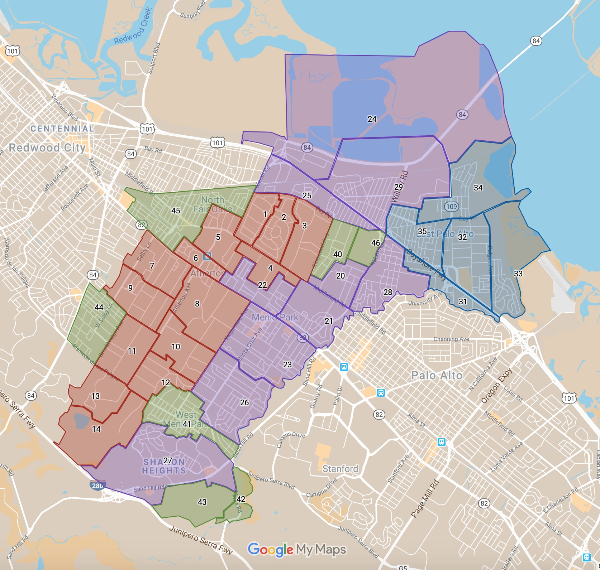

# Menlo Park Fire Protection District — Community Crisis Management Map

- Latest update: 2020-03-29
- Source: http://www.menlofirecert.com/neighborhoods
- Source map revision: 2019-09-14

## Area Groups

- 1-19 Atherton
- 20-29 Menlo Park
- 30-39 East Palo Alto
- 40-49 Unincorporated SMC, Federal, & Others

## License

All source data belong to [Menlo Park Fire Protection
District](https://www.menlofire.org/).

The map data is made available by [Behnam Esfahbod](https://behnam.es/) under
[Creative Commons CC0 1.0 Public Domain
Dedication](https://creativecommons.org/publicdomain/zero/1.0/).
